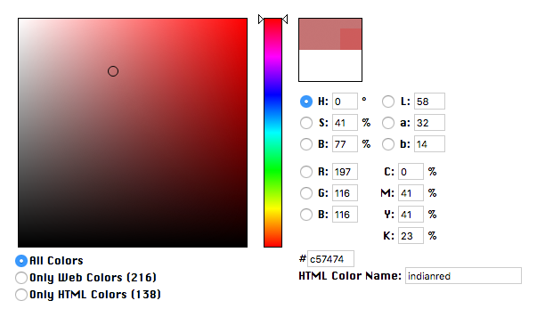
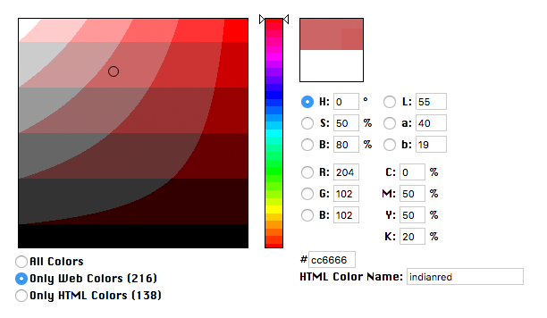
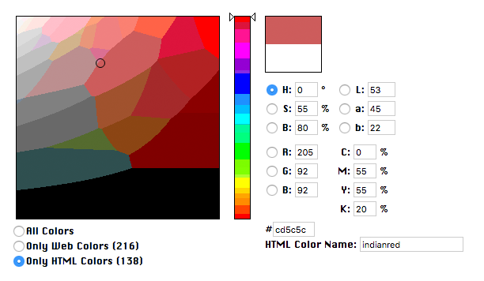
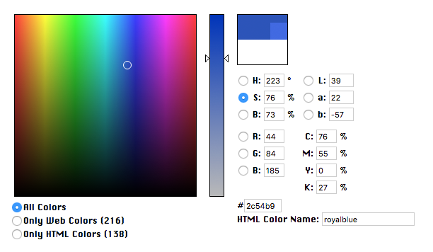
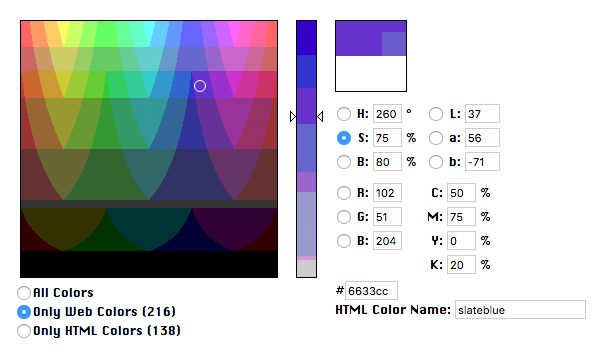
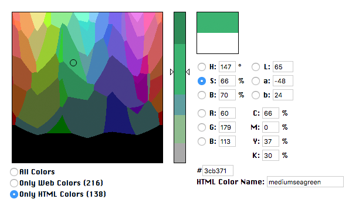
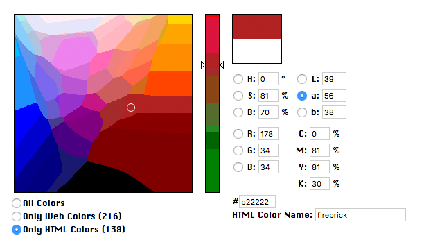

# Color Selector

Project under development (2018). This is a color picker, which mimics the one from of Photoshop (with RGB, HSB, Lab, CMYK, web colors filter), implemented in JS/WebGL, with a new feature that let you know the name of the closest HTML/CSS color ([cf. w3c](https://www.w3.org/wiki/CSS/Properties/color/keywords)).

At this stage of development, the software has only been tested on Google Chrome, on the Macintosh. Please use Chrome to test.

Here are some screenshots to illustrate some features:

## HSB

HSB Profile (H)

HSB Profile (H) + Web colors

HSB Profile (H) + HTML/CSS colors

HSB Profile (S) + Web colors

HSB Profile (S) + HTML/CSS colors

Lab Profile (a) + HTML/CSS colors

